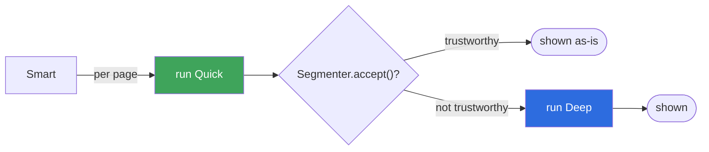

# Viewer modes: Smart, Quick, Deep

What the three panel-detection modes mean for the reader, how they map onto
the internals, and where to change them.

See also: [DETECTION.md](DETECTION.md) for the full detection pipeline these
modes select between, and [ARCHITECTURE.md](ARCHITECTURE.md) for how the
viewer and menu layers fit together.

## The Active Default: Component Mode (`components`)

The primary detector is **Component Mode** (`components`). It performs 8-connected flood-fill analysis on the page's background-normalized ink map, with straight-line boundary verification (`frameSides`).

| Menu / internal label | `detector` value | Primary Engine |
| --- | --- | --- |
| **Component Mode (Default)** | `components` | 8-connected flood fill with geometric edge verification + full-page fallback |
| **Deep Mode (Fallback)** | `exact` | KOReader's native K2pdfopt detector (available when small bitmap cannot be extracted) |

### Swipe Navigation Directions

Panels+ aligns swipe gestures with natural reading flow:
- **Comic Mode (Left to Right)**: Swipe **east** (left-to-right) to advance to the next panel; swipe **west** to return to previous.
- **Manga Mode (Right to Left)**: Swipe **west** (right-to-left) to advance to the next panel; swipe **east** to return to previous.
- **Invert Swipe**: The *Invert panel swipe direction* menu option flips these gestures for readers who prefer drag-based page-turning gestures.

## Quick mode

Renders the page small (~1/3 scale), measures the page border to learn
whether it's a light or dark page, marks every pixel that differs from that
background as ink, and recursively slices the ink map along its widest empty
band — the "gutter" between panels. See
[DETECTION.md → the segmenter pipeline](DETECTION.md#the-segmenter-pipeline)
for the full walkthrough, including the slanted-gutter search for panels that
aren't perfectly square.

- **Fast**: one small render per page, no matter how many panels it finds.
- **Only mode that works on dark pages** — the background is measured, not
  assumed white, so white-on-black pages segment exactly like black-on-white
  ones.
- **Can't split interlocking or diagonal layouts** — there is no straight (or
  gently slanted) empty line to cut along, so those come back as one
  undivided region.

## Deep mode

Runs KOReader's own `getPanelFromPage` detector — the same one KOReader's
reflow mode uses — batched so the page is rasterized at full resolution once
and probed at many points, instead of once per probe. See
[DETECTION.md → the native detector, batched](DETECTION.md#the-native-detector-batched).

- **Slower**: a full-resolution rasterization per page, plus one probe per
  grid point not already inside a found panel.
- **Fails on dark backgrounds** — it thresholds against white with no
  inverse, so there's nothing to find on an inked page.
- **More literal about panel edges**, and can often resolve interlocking or
  diagonal layouts that defeat a straight-line cut.
- The only mode available while KOReader's reflow / page-optimization
  modes are active, since the small-render pipeline Quick mode needs is
  unavailable there.
- **Unavailable in comic mode.** Deep mode's white-only threshold gives up
  on the dark backgrounds comic scans routinely have, so switching to comic
  reading mode forces `detector` back to Smart if Deep was active, and the
  **Deep mode** menu option is greyed out while comic mode is on. The
  in-viewer mode button honors the same rule: cycling in comic mode skips
  straight from Quick back to Smart instead of offering Deep
  ([`ViewerController:cycleViewerDetector`](../src/viewer_controller.lua)).

## Smart Mode

Runs Quick first. [`Segmenter.accept()`](DETECTION.md#knowing-when-the-cut-is-wrong)
checks the result against a few sanity thresholds (how many panels, how much
of the page they cover, how much area they retain) and only falls back to
Deep, per page, when Quick's result looks untrustworthy — not on a fixed
schedule, and not for the whole book at once. This is the recommended and
default setting: most pages get Quick's speed, and the pages Quick can't
split still come out correctly via Deep.

## Where to change it

- **Menu**: *Panels+ → Panel detection*, a radio choice between the three
  modes ([`menu.lua`](../src/menu.lua)).
- **Panel-view button**: while a panel is open, the mode button cycles
  Smart → Quick → Deep → Smart and immediately re-detects the current page
  with the new mode, keeping the panel you're on in view
  ([`ViewerController:cycleViewerDetector`](../src/viewer_controller.lua)).
  Its label is drawn from [`PanelViewer:getDetectorText`](../src/_panelviewer.lua).

## Diagnosing which mode is misreading a page

Turn on **Panels+ → Log panel timings**, reopen the page, and check the log —
covered in [DETECTION.md → Diagnosing a page](DETECTION.md#diagnosing-a-page).
If a page looks wrong, forcing Quick or Deep via the mode button tells you
immediately which detector is at fault, before you touch any tuning values in
`src/_settings.lua`.

"Log panel timings" doesn't give you a Panels+-specific file to open. Under
the hood it just calls KOReader's own `logger.info`/`logger.warn` (see
[`_timing.lua`](../src/_timing.lua) and the `logger.warn` calls in
[`_pagebitmap.lua`](../src/_pagebitmap.lua) and
[`_nativedetector.lua`](../src/_nativedetector.lua)), so you'll find every
line sitting in KOReader's regular log, mixed in with everything else it logs:

- **File**: `crash.log`, next to your KOReader install directory (not inside
  the Panels+ plugin folder, and not a separate Panels+ log).
- **Prefix**: every line this plugin emits starts with the prefix `[Panels+]`,
  so you can grep/filter the logs easily — e.g. `grep '\[Panels+\]' crash.log`.
- **Toggle scope**: the setting only controls whether Panels+ *writes* these
  lines. It won't create or rotate `crash.log` for you, and turning it off
  won't clear anything you've already logged.

See [PERFORMANCE.md → Measuring on your device](PERFORMANCE.md#measuring-on-your-device)
for the full log format and a worked example of a healthy vs. slow page.

## Choosing a mode

For most reading, leave it on **Smart** — it's the default for a reason: fast
on the common case, correct on the pages Quick can't handle. Reach for a
forced mode only when you already suspect which detector is wrong for a
specific book:

- Force **Quick** if you're reading scans with dark or inverted pages and
  want to confirm panels are still splitting correctly without Deep mode's
  fallback masking a problem.
- Force **Deep** if a book has interlocking or diagonal panel layouts that
  Smart keeps rendering as one undivided region — this skips Quick's attempt
  entirely instead of waiting for it to fail per page.
- Switch back to **Smart** once you're done diagnosing; a forced mode stays
  forced for every page in every book until you change it again, so it's easy
  to forget it's on after moving past the page that needed it.
